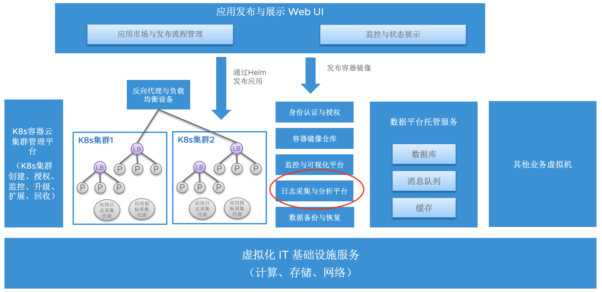

# 谈谈容器环境的日志管理 和 vRealize Log Insight

## 摘要
”日志管理“ 是基于 Kubernetes 的现代化应用平台不可缺少的组件。 本文主要介绍了日志管理的概念，以及VMware vRealize Log Insight 如何集成 Fluent-Bit，实现对于 K8s 的日志的管理。 

## 1. 为什么需要集中的 K8s 日志平台

### 1.1 日志的使用场景
日志在 IT 运维管理中一直是一个很重要的方面，通常来说，主要包括以下两个使用场景：

1. **排错**：日志包含详细的问题现场，可以看到发生问题的前后，系统到底发生了什么事情。 另外，当问题发生时，通常还需要查看这个问题的影响范围，发生的频率等等。 这边需要额外说明一下：虽然说，在k8s的理念中，当发生问题的时候，通常不鼓励去排错，而是通过删掉重建的方式来解决；但是在实际场景中，即使重建，某些问题也可能重复的出现；或者是有状态的应用或者配置的问题，无法通过删除重建来解决。  

2. **指标**：通过日志，我们可以统计一些IT和业务的指标，比如状态码为 500 的HTTP Response的数量。 

3. **告警**：我们可以监控日志中的关键信息，比如 Critical 级别的日志，或者 HTTP 500 的数量大于某个阈值。

日志可能来自于平台或者应用。 IT 基础设施团队更加关心平台日志，而应用团队更加关心应用日志。 作为基础设施部门，当构建一个完整的现代化应用平台，应当包含日志组件。

### 1.2 为什么需要集中的日志平台

所有的系统都会在本地写日志文件，或者打印到 "标准输出(stdout)"和"标准错误(stderr)"。很多的管理员在发现故障的时候，都会登录到系统去查看日志。 当然，最常见的方法，就是 `cat xxxx.log | grep -i yyyy` 这样的命令。 当然，这样的方法在传统的平台上排错，似乎也未尝不可。 但是在 K8s 平台之下，这种方法会遇到两方面的挑战：

1. Pod 已经被 terminate 掉了：K8s 平台管理的 pod 的方式是，当 pod 出问题的时候，pod 就会被 K8s 平台自动 terminate 掉，然后创建新的 pod 来替代它。 但是，对于排错来说，当一个 pod 已经被 terminate 掉的时候， 我们是无法通过 `kubectl logs <pod_name>` 这样的命令去查看 pod 日志的。 而如果使用集中日志平台，所有的日志都会被转发到平台，方便日后查询。   

2. 不知道查看哪个 Pod：在 K8s 中，一个 deployment 包含一组一样的 pod，service 通过负载均衡把请求分发到各个 pod。 当发生故障的时候，其实，并不一定有明确的信息能够知道到底是哪个 pod 出了问题。 难道我们要一个 pod 一个 pod 的去查看吗？ 集中日志平台可以提供搜索功能来解决这样的问题。 

至于 “指标” 这样的需求，如果没有集中的搜集日志，自然无法做统计。 

针对于 ”告警“，我们当然可以 在每个 pod 中通过 sidercar 运行一个 agent 去实现日志的监控和告警，但是这样做不但带来很多运维的负担，而且需要消耗更多的系统资源。 


### 1.3 集中日志管理是现代化应用平台的核心组件
事实上，当我们介绍现代化应用平台的时候，我们需要包含一些核心组件，如下图所示，日志管理平台就在其中。 



IT 基础设施团队需要一个集中日志平台来管理 K8s 平台的日志。 应用团队，当然也需要日志平台管理应用的日志。 IT 基础设施团队和应用团队可以共用一个平台，也可以分开。主要取决于业务的流量（2C还是2B），以及部门之间的分工。 在下文的描述中，我们主要侧重于传统行业的 IT 基础设施部门的需求，不讨论互联网用户的 2C 的应用的需求。 


## 2. 日志平台的选择，以及 VMware vRealize Log Insight 是什么？

### 2.1 日志平台的选择多种多样

一谈到日志管理，很多初次了解这个领域的用户，可能经常听说到大名鼎鼎的 ElasticSearch，或者老牌的 Splunk，也可能听说过新兴的 Grafana Loki，或者公有云的 SaaS 服务。 本文无意对这些平台进行比较，他们都是很好的产品，都值得去了解和尝试。  

本文将要介绍的 VMware vRealize Log Insight 这款 VMware 发布的日志管理平台，可能听说过用户不多；似乎 VMware 官方也没有花太多的力气去宣传和推广这个产品。 事实上，这个产品已经出现很多年了。近期，在和一些用户的 IT 基础设施部门讨论现代化应用平台的构建时候，用户反馈这个产品其实很好。 我开始有些好奇，但是讨论之后，发现其实是有道理的。

### 2.2 vRealize Log Insight 的优势
VMware vRealize Log Insight 可以满足日志管理的常见需求，并且在以下几个方面具有一定的优势：

1. **很多 VMware 的用户已经有了的产品的授权和技术支持**： 事实上，很多用户在采购的过程中，为了方便和获得更好的折扣，采购的都是套件，最常见的比如vRealize Suite 或者 vCloud Suite，或者 VMware Cloud Foundation。 事实上，这些套件中都已经包含 vRealize Log Insight 这个产品的授权。 当然，拥有这些合法授权的用户，都可以通过电话或者邮件获得 VMware 官方的远程技术支持。 


如果您使用的是VMware Tanzu Kubernetes Grid，其中的包含fluent-bit的授权，fluent-bit是一个日志采集的agent。 所以，您可以获得整个解决方案中从日志采集到日志分析管理平台的整体方案的授权和技术支持。 


2. **运维简单**：秉承 VMware 产品的设计惯例，vRealize Log Insight 的安装配置只需要导入一个 OVF/OVA 文件即可。 在资源不足需要扩展的时候，通过部署另一个实例，即可以实现集群的横向扩展。 

3. **统一的 IT 基础设施日志管理平台**：在构建一个完整的现代化应用平台中，K8s 需要计算、存储和网络资源池。 如果您使用的是 VMware 的 vSphere,vSAN，NSX, 我们完全可以通过统一的平台来采集 vSphere、vSAN、NSX 的平台日志，这样结合 K8s 的日志，我们可以更好的进行关联排错。 

## 3. 使用 vRealize Log Insight 体验日志管理
我们下面简单体验一下如何通过vRealize Log Insight 实现 Tanzu Kubernetes Grid 的日志管理。 

### 3.1 实验环境

本次的实验环境包含一个 vSphere 7.0 U3 的环境，其中我们通过 Tanzu Supervisor Cluster 在 WCP namespace vds-prod 创建了一个 Tanzu Guest Cluster - hr-prod，用作本次的 demo。 hr-prod 包含 1 个 master node 和 3 个 worker nodes。

我们在 vSphere 集群中部署了一台 vRealize Log Insight 的虚拟机。 顺便打一下广告，从这里我们也看到，vSphere with Tanzu 的优势之一，就是可以提供一个 "虚拟机" 和 "容器" 混合的运行环境，他们可以共享底层的资源，包括计算、存储和网络。 这样用户不必单独维护一套新的技术栈来运行 K8s 集群。 

### 3.2 Sample 应用
我们利用 flog 应用，这是一个 log 生成器，具体可以参看 https://github.com/mingrammer/flog。
`flog -f json -d 1s -l` 会每隔 1 秒钟 生成一个 json 格式的日志，打印到 stdout。 请大家关注其中的标签 ` "app: flog" `，在后面，我们使用这个 label 可以对日志进行过滤。 

``` yaml
apiVersion: apps/v1
kind: Deployment
metadata:
  name: flog
spec:
  selector:
    matchLabels:
      app: flog
  replicas: 2 
  template:
    metadata:
      labels:
        app: flog
    spec:
      containers:
      - name: flog
        image: mingrammer/flog
        command: ["flog"]
        args: ["-f", "json", "-d", "1s", "-l"]
```

我们可以通过 kubectl logs 查看一下输出的日志格式：

``` bash
[hanliang@jump-centos logging]$ kubectl logs flog-85b7f6466c-gzkwj | tail -n 5
{"host":"37.128.201.179", "user-identifier":"stamm4215", "datetime":"08/Jun/2022:01:07:39 +0000", "method": "GET", "request": "/deliverables/syndicate", "protocol":"HTTP/1.1", "status":406, "bytes":24826, "referer": "https://www.globalefficient.org/whiteboard/morph/deliver/e-tailers"}
{"host":"197.116.149.211", "user-identifier":"-", "datetime":"08/Jun/2022:01:07:40 +0000", "method": "PATCH", "request": "/bandwidth/e-enable/clicks-and-mortar/one-to-one", "protocol":"HTTP/2.0", "status":403, "bytes":9342, "referer": "https://www.regionalextensible.name/frictionless/implement/clicks-and-mortar"}
{"host":"20.150.212.88", "user-identifier":"-", "datetime":"08/Jun/2022:01:07:41 +0000", "method": "DELETE", "request": "/transform/deliverables", "protocol":"HTTP/1.1", "status":205, "bytes":28235, "referer": "https://www.dynamicholistic.org/one-to-one/facilitate"}
{"host":"54.123.58.243", "user-identifier":"bailey3716", "datetime":"08/Jun/2022:01:07:42 +0000", "method": "PATCH", "request": "/implement/facilitate", "protocol":"HTTP/2.0", "status":200, "bytes":24820, "referer": "https://www.legacyproactive.biz/seize"}
{"host":"51.202.9.99", "user-identifier":"dickens6278", "datetime":"08/Jun/2022:01:07:43 +0000", "method": "PUT", "request": "/enable/plug-and-play/magnetic/incentivize", "protocol":"HTTP/1.1", "status":504, "bytes":7230, "referer": "https://www.productvisionary.org/transition/models"}
```

### 3.3 在 Guest Cluster 中配置 Fluent-bit
在 Guest Cluster 中配置 Fluent-bit 不是一个复杂的事情。 在安装配置好 vRealize Log Insight 之后，我们访问 `https://<ip-address>/log-sources/containers`，可以看到如何配置 fluent-bit 的手册，如下图所示：


其步骤大致做了两件事情：
1. 创建 fluent-bit 的配置文件，并且相应的 configmap
2. 部署 fluent-bit 的 daemonset

在完成之后，我们可以通过 `kubectl get daemonset,pod -l="app=log-collector" -n kube-system -o wide`，如果看daemonset 和pod 都是正常运行的，那我们的配置就完成了。 

``` bash
[hanliang@jump-centos logging]$ kubectl get daemonset,pod -l="app=log-collector" -n kube-system -o wide
NAME                           DESIRED   CURRENT   READY   UP-TO-DATE   AVAILABLE   NODE SELECTOR   AGE   CONTAINERS   IMAGES                                                         SELECTOR
daemonset.apps/log-collector   4         4         4       4            4           <none>          32h   fluentd-li   projects.registry.vmware.com/vrealize_loginsight/fluentd:1.1   name=log-collector

NAME                      READY   STATUS    RESTARTS   AGE   IP           NODE                                     NOMINATED NODE   READINESS GATES
pod/log-collector-4nwm9   1/1     Running   0          32h   172.21.2.4   hr-prod-workers-j7dxl-55798b6459-wpt9c   <none>           <none>
pod/log-collector-lpbmg   1/1     Running   0          32h   172.21.1.4   hr-prod-workers-j7dxl-55798b6459-l9lts   <none>           <none>
pod/log-collector-sz85x   1/1     Running   0          32h   172.21.3.4   hr-prod-workers-j7dxl-55798b6459-65ljt   <none>           <none>
pod/log-collector-z6qbw   1/1     Running   0          32h   172.21.0.9   hr-prod-control-plane-n2lqg              <none>           <none>
```

### 3.4 日志查看和检索
在上述工作完成之后，我们可以登录到 vRealize Log Insight 检索相关日志。 

在下图中，我们使用 `"k8s_app 包含 flog"`, `"text 包含 status:500"` 这样的筛选器，得到下面的日志。 在截图上半部分的柱状图，我们也可以看到日志数量的变化趋势。 


点击下面单个事件最左边的齿轮图标，然后选择 “在环境中查看事件“（如下图所示），我们就可以看到此事件前后生成的日志，便于管理员排错时了解前后都发生了什么事情。 


其中，粉红色的日志为前文中为锚点的日志条目。 


### 3.5 进一步的日志分析
vRealize Log Insight 提供了丰富的日志分析和管理功能，大家可以后续尝试，包括：
1. 基于正则表达式提取动态字段： https://docs.vmware.com/cn/vRealize-Log-Insight/8.8/com.vmware.log-insight.user.doc/GUID-C71CE974-D941-4B99-AF29-86BFA8B25C5C.html
2. 自定义仪表板：https://docs.vmware.com/cn/vRealize-Log-Insight/8.8/com.vmware.log-insight.user.doc/GUID-26D795C4-1F7A-493E-AB45-2B336ACAF0D1.html
3. vRealize Log Insight 集群的横向扩展：https://docs.vmware.com/cn/vRealize-Log-Insight/8.8/com.vmware.log-insight.administration.doc/GUID-B793B5C7-C856-4324-8202-EBB35265BA7B.html

## 4. 总结
”日志管理“ 是基于 Kubernetes 的现代化应用平台不可缺少的组件。 本文主要介绍了日志管理的概念，以及VMware vRealize Log Insight 如何集成 Fluent-Bit，实现对于 K8s 的日志的管理。 

在销售模式上，vRealize Log Insight 通常包含在 VMware 的一些常见套件中。您不妨看一下您已经采购的 VMware 软件授权，也许您已经拥有了 vRealize Log Insight 的授权，为什么不试一下呢？ 

## 5. 参考资料
- https://docs.vmware.com/cn/vRealize-Log-Insight/index.html
- https://github.com/mingrammer/flog
