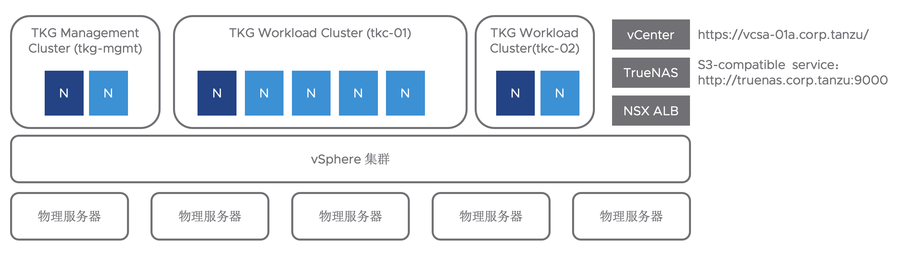
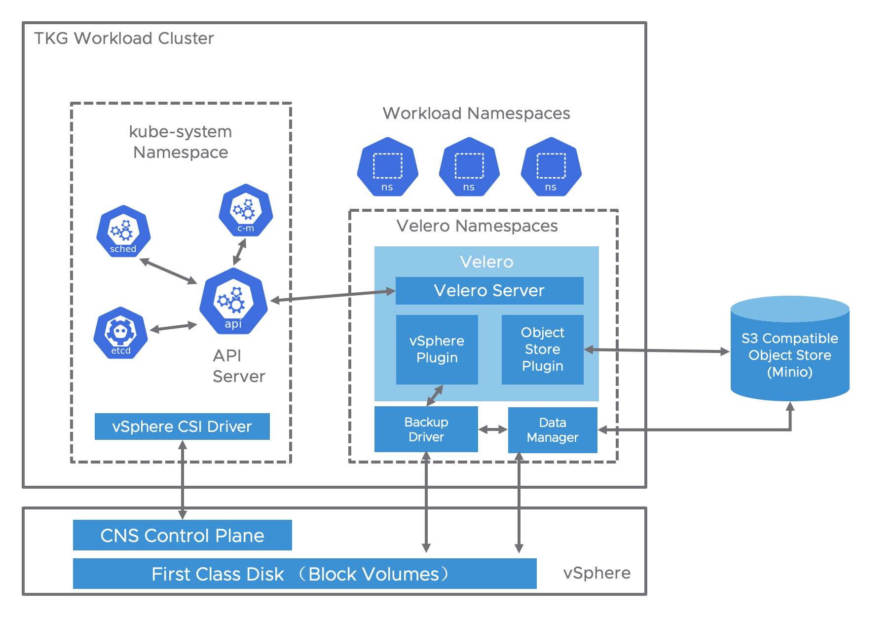
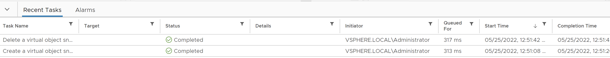
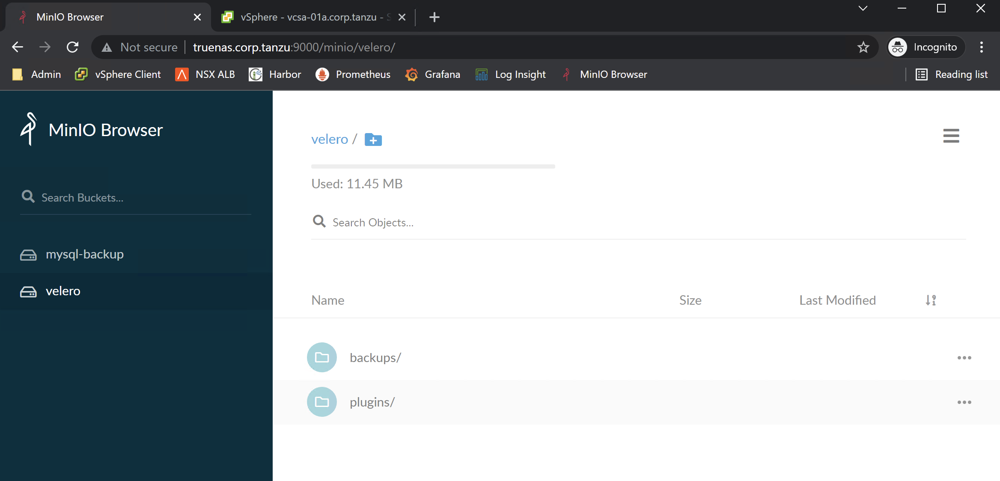

# 集成 Velero 实现 VMware Tanzu Kubernetes Grid 的数据保护


## 1. 基于 Velero 的 K8s 数据保护简介 
[Velero](https://velero.io/) 是一个开源的 Kubernetes 数据保护工具。 

在 Kubernetes 中，需要保护的数据主要包括两种类型："Resource" 和 "PersistentVolume"（PV）。 其中 "Resource" 包括 Deployment, Pod, Service, Ingress 等等，这些在 Kuberentes 中通常以 YAML 或者 JSON 文件形式描述。 "PersistentVolume" 也是一个K8s对象，通常存放的用户数据，比如数据库文件。 

在 Velero 中，Resource的备份由 Veleo 核心代码负责；而 PV 的备份通常由插件完成。 而这个 PV 备份的插件从实现方式上，可以分为两种 - 存储快照 和 文件系统备份。 

- 存储快照的方式，举例来说，AWS上通过 EBS 的快照实现；vSphere 上则通过 vSphere VMDK 的快照实现。不同的存储有不同的快照实现方式，而 velero 中通过定义统一的接口，然后各个存储厂商通过 Plugin 的方式去实现这个接口。 
- 文件系统的方式，则是通过一个开源工具 restic 来实现。 Restic 原理是基于文件系统的数据拷贝，可以兼容各类存储，具体可以参看 https://velero.io/docs/main/restic/。 

以上两种方式，各有其优缺点，存储快照的优势主要包括：
- 存储快照的方式效率更高，通常情况下小于1秒，所以对应用的影响更小，而 Restic 的文件拷贝通常较慢。
- 存储快照的方式可以提供更好的数据一致性（通常至少是crash consistency），而 Restic 的文件拷贝方式，通常很难保证数据一致性（当然，可以通过 fsfree 的方式来实现文件系统的静默，但是如果数据量比较大，文件拷贝需要很长的时间，这样的静默在实际场景中，很难说是否可行）。

但是 Restic 也有其优势，比如：
- 不依赖于底层存储的快照功能。事实上，并不是所有的 K8s 存储都提供了 PV 快照功能。
- 在恢复时，可以恢复到不同类型的存储上。比如如果我在本地的 vSphere 上面的PV，要恢复到 AWS 上面去。  

在本文中，我们介绍使用 Velero 结合 Velero vSphere Plugin 来实现 K8s 的数据保护。 以下的所有的操作基于 Tanzu Kubernetes Grid 1.4 workload cluster, Velero v1.8.1，以及 velero-plugin-for-vsphere v1.3.1。

## 2. TKG 测试环境
本次测试环境是用 TKG 1.4，其中包含 1个 management cluster，2个 workload clusters(tkc-01, tkc-02).  我们使用 tkc-01 作为本次测试的 vanilla kubernetes cluster。 tkc-01中包含一个master node和4个worker nodes。 TKG K8s cluster 使用 NSX Advanced Load Balancer 作为 Cloud Provider 提供 K8s LoadBalancer 的服务。 



我们可以通过命令看一下 tkc-01 的节点情况。 
```
ubuntu@cli-vm:~/myvelero$ kubectl get nodes
NAME                           STATUS   ROLES                  AGE   VERSION
tkc-01-control-plane-n4l6l     Ready    control-plane,master   69d   v1.22.5+vmware.1
tkc-01-md-0-78fc885d47-6km64   Ready    <none>                 68d   v1.22.5+vmware.1
tkc-01-md-0-78fc885d47-n9m9s   Ready    <none>                 25d   v1.22.5+vmware.1
tkc-01-md-0-78fc885d47-njtd4   Ready    <none>                 69d   v1.22.5+vmware.1
tkc-01-md-0-78fc885d47-qzlbl   Ready    <none>                 24d   v1.22.5+vmware.1
```

## 3. 示例应用介绍
本次测试使用 Nginx。大家可以参考 nginx-with-pv.yaml。其中，我们把 /usr/share/nginx/html 目录mount到一个 PV 中。 这个PV就是我们需要备份的对象之一。 我们稍后会修改 /usr/share/nginx/html 中的 index.html 文件， 来模拟数据的变化。  我们创建 namespace test， 用来部署这个示例应用。 

在部署完成之后，我们可以看到在test namespace中，有一个 deployment 对应一个replicaset以及一个pod；另外有一个LoadBalancer 类型的Service，EXTERNAL-IP为192.168.220.15（在实际环境中，这个IP地址可能不一样的）。 

```
ubuntu@cli-vm:~/myvelero$ kubectl get all -n test
NAME                        READY   STATUS    RESTARTS   AGE
pod/nginx-bbb8b66c4-k5h4g   1/1     Running   0          2d3h

NAME            TYPE           CLUSTER-IP      EXTERNAL-IP      PORT(S)        AGE
service/nginx   LoadBalancer   100.69.29.121   192.168.220.15   80:31235/TCP   2d3h

NAME                    READY   UP-TO-DATE   AVAILABLE   AGE
deployment.apps/nginx   1/1     1            1           2d3h

NAME                              DESIRED   CURRENT   READY   AGE
replicaset.apps/nginx-bbb8b66c4   1         1         1       2d3h
```

同时，我们通过 `kubectl get pvc -n test` 以及 `kubectl get pv` 可以看到相应的PVC 和 PV，这个PV就是用来保存 /usr/share/nginx/html 目录下的文件的。 
特别强调一下，这个 PV 的 回收策略 （RECLAIM POLICY）是 **Delete**，这也就意味着，当我删除PVC的时候，这个 PV 会自动被删除，这样可以模拟一个存储故障或者误删除。

```
ubuntu@cli-vm:~/myvelero$ kubectl get pvc -n test
NAME                 STATUS   VOLUME                                     CAPACITY   ACCESS MODES   STORAGECLASS   AGE
nginx-html-content   Bound    pvc-620d3037-a8bd-43c8-8bd9-cc4e9530598a   50Mi       RWO            default        2d3h
ubuntu@cli-vm:~/myvelero$

ubuntu@cli-vm:~/myvelero$ kubectl get pv
NAME                                       CAPACITY   ACCESS MODES   RECLAIM POLICY   STATUS   CLAIM                                    STORAGECLASS   REASON   AGE
pvc-08075337-7bcc-4f6e-8ff2-e58458d3a04a   50Mi       RWO            Delete           Bound    test/nginx-html-content                  default                 64s
```

我们使用命令在 pod 中创建 /usr/share/nginx/html/index.html，并且通过 curl 命令查看 nginx 的输出。 

```
ubuntu@cli-vm:~/myvelero$ kubectl exec -n test nginx-bbb8b66c4-k5h4g -- bash -c 'echo "hello world 001" > /usr/share/nginx/html/index.html'
ubuntu@cli-vm:~/myvelero$ curl http://192.168.220.15
hello world 001
```

## 4. Velero 部署架构

下面我们介绍一下 Velero 的系统架构：



在上图中，我们可以看到，在velero的namespace中，部署有 velero server. Velero Server 需要备份 应用的 K8s Resource 和 PV，分别的过程如下：
- Velero server 通过 K8s API Server 获取需要备份的 K8s Resource，
- Velero server 通过 vSphere Plugin - Backup Driver 针对 Volume 打快照（在vSphere中为独立于 VM 的 VMDK 形式出现，又叫 First Class Disk，并且通过 Data Manager 组件将快照传输到 S3兼容的对象存储上（在我们实验中，使用的是Minio）。

所以，这里要单独提一下，velero的 plugin 还有一类是用来对接对象存储，放置备份数据的。在本文中，我们使用的是 aws plugin ，对接兼容 S3 的 minio 对象存储。

实际上，Velero vSphere Plugin 提供了两种模式：Vanilla 和 vSphere with Tanzu.  Vanilla 的中文意思是”普通的“，”寻常的“，简单的说，就是 upstream 的 Kubernetes，不限定特定厂商的发行版本。 而 vSphere with Tanzu 是专门为了满足 vSphere 7.0 中的 Supervisor Cluster/Guest Clusters 的二层架构，特别开发的。其主要的优势，就是避免业务网络中的 workload cluster 直接访问管理网络中的vCenter Server，增强了安全性。 由于 velero vSphere plugin 需要在 Supervisor Cluster 中通过 PodVM 的方式部署组件，所以必须要求使用 NSX-T。 具体大家可以参考 https://github.com/vmware-tanzu/velero-plugin-for-vsphere

如果您对 vSphere with Tanzu 不太熟悉，也不要紧。为了更好的兼容性，在本文中，我们使用 Vanilla vSphere Plugin 部署模式。 

## 5. Velero with vSphere Plugin 安装部署

我们使用 Velero install 命令还部署 velero server。 

``` bash
velero install \
    --image ghcr.io/alexhanl/velero/velero:v1.8.1  \
    --provider aws \
    --plugins ghcr.io/alexhanl/velero/velero-plugin-for-aws:v1.4.1 \
    --bucket velero \
    --secret-file ./credentials-velero \
    --backup-location-config region=minio,s3ForcePathStyle="true",s3Url=http://truenas.corp.tanzu:9000 \
    --snapshot-location-config region=minio
```

其中，我们使用的 velero:v1.8.1 和 velero-plugin-for-aws:v1.4.1 容器镜像，我们可以使用 dockerhub 的公开镜像仓库；在不能连接互联网的环境中，也可以使用本地的镜像仓库；为了演示的便利性，我们使用的是我在 github 的镜像仓库。 大家可以根据需要自行修改。 

如果您这边使用的 s3Url 是 https 的，而您又是使用的自签名证书，则需要注意在velero install 中增加 --cacert 的参数。当然，如果你使用的是正式证书，或者您用的是公有云的s3服务，则不需要考虑这个证书问题。 

接下来我们安装 velero vSphere Plugin。
下面的命令主要是将 vCenter Server 的账号和密码给到 velero vSphere Plugin。 大家可以参看csi-vsphere.conf 文件。在实际中，建议单独创建一个账号，这个账号的权限主要就是 VMDK 快照。

```
kubectl -n velero create secret generic velero-vsphere-config-secret --from-file=csi-vsphere.conf

kubectl -n velero apply -f velero-vsphere-plugin-config-map.yaml
```

通过 velero plugin add 的命令部署 vSphere plugin。

```
velero plugin add ghcr.io/alexhanl/vsphereveleroplugin/velero-plugin-for-vsphere:v1.3.1
```

在全部完成之后，我们应该可以看到下面的输出。 在实验环境中，包含一个veleor server的pod，一个backup-driver的pod，以及4个data manager pod分别部署在每个node上面。 如果以上都很正常，我们就可以进行功能验证了。 

```
ubuntu@cli-vm:~/myvelero$ kubectl get po -n velero -o wide
NAME                               READY   STATUS    RESTARTS   AGE    IP             NODE                           NOMINATED NODE   READINESS GATES
backup-driver-db66f9588-jxql2      1/1     Running   0          2d4h   100.96.3.101   tkc-01-md-0-78fc885d47-n9m9s   <none>           <none>
datamgr-for-vsphere-plugin-68l7x   1/1     Running   0          2d4h   100.96.3.102   tkc-01-md-0-78fc885d47-n9m9s   <none>           <none>
datamgr-for-vsphere-plugin-cbzfw   1/1     Running   0          2d4h   100.96.2.53    tkc-01-md-0-78fc885d47-6km64   <none>           <none>
datamgr-for-vsphere-plugin-lzw2g   1/1     Running   0          2d4h   100.96.1.188   tkc-01-md-0-78fc885d47-njtd4   <none>           <none>
datamgr-for-vsphere-plugin-nqzv9   1/1     Running   0          2d4h   100.96.4.89    tkc-01-md-0-78fc885d47-qzlbl   <none>           <none>
velero-5897d68d9d-phpm8            1/1     Running   0          30h    100.96.3.110   tkc-01-md-0-78fc885d47-n9m9s   <none>           <none>

ubuntu@cli-vm:~/myvelero$ kubectl get daemonsets.apps -n velero
NAME                         DESIRED   CURRENT   READY   UP-TO-DATE   AVAILABLE   NODE SELECTOR   AGE
datamgr-for-vsphere-plugin   4         4         4       4            4           <none>          2d4h

```

## 6. 功能验证

velero 支持单次任务备份，也支持计划任务。 我们先看一个简单的单次任务备份和恢复。 

我们通过 velero backup create 命令来备份整个 test namespace 。
```
velero backup create nginx-backup-01 --include-namespaces test 
```

通过 `velero backup get` 我们可以看到备份情况。 
```
ubuntu@cli-vm:~$  velero backup get
NAME              STATUS      ERRORS   WARNINGS   CREATED                         EXPIRES   STORAGE LOCATION   SELECTOR
nginx-backup-01   Completed   0        0          2022-05-25 01:50:44 -0600 MDT   29d       default            <none>
```

同时，我们可以看到vcenter上面的快照任务。


我们在minio的界面上也可以看到已经保存的数据。 


我们通过命令 `kubectl delete ns test` 删除整个namespace，来模拟故障。 同时确认对应的 pv 已经被回收，并且系统已经无法访问。  

```
ubuntu@cli-vm:~/myvelero$ kubectl get pv | grep nginx-html-content
ubuntu@cli-vm:~/myvelero$ curl http://192.168.220.15
curl: (7) Failed to connect to 192.168.220.15 port 80: No route to host
```

我们下面通过 velero restore 命令恢复数据。  

```
ubuntu@cli-vm:~/myvelero$ velero restore create --from-backup nginx-backup-01
Restore request "nginx-backup-01-20220525020632" submitted successfully.
Run `velero restore describe nginx-backup-01-20220525020632` or `velero restore logs nginx-backup-01-20220525020632` for more details.
ubuntu@cli-vm:~/myvelero$
```

确认所有的资源都已经恢复。 
```
ubuntu@cli-vm:~/myvelero$ kubectl get all -n test
NAME                        READY   STATUS    RESTARTS   AGE
pod/nginx-bbb8b66c4-k5h4g   1/1     Running   0          27s

NAME            TYPE           CLUSTER-IP       EXTERNAL-IP      PORT(S)        AGE
service/nginx   LoadBalancer   100.65.236.144   192.168.220.15   80:32526/TCP   24s

NAME                    READY   UP-TO-DATE   AVAILABLE   AGE
deployment.apps/nginx   1/1     1            1           27s

NAME                              DESIRED   CURRENT   READY   AGE
replicaset.apps/nginx-bbb8b66c4   1         1         1       27s

ubuntu@cli-vm:~/myvelero$ k get pv
NAME                                       CAPACITY   ACCESS MODES   RECLAIM POLICY   STATUS   CLAIM                                    STORAGECLASS   REASON   AGE
pvc-f3449598-6e8f-4c51-bcc6-072d347e6147   50Mi       RWO            Delete           Bound    test/nginx-html-content                  default                 78s
```

注意，这里的 service/nginx 的 EXTERNAL-IP 未必和原来的是一样的。这是由 NSX ALB 在 VIP pool 中进行分配的。 

通过curl 命令确认应用已经正常访问。 
```
ubuntu@cli-vm:~/myvelero$ curl http://192.168.220.15
hello world 001
```

## 7. 进一步的功能验证

后续大家可以基于此，进行更多的场景/应用的验证，我把相应的文档和建议也放到下面：
- 基于 label 和 resource 类型的过滤：https://velero.io/docs/v1.8/resource-filtering/
- 基于计划任务的调度： https://velero.io/docs/v1.8/how-velero-works/#scheduled-backups
- 数据库的备份/恢复验证：这里大家需要注意的是一致性问题。如果希望更好的保障一致性，可以考虑使用 Hook 机制进行操作系统的 fsfreeze，可以参看 https://velero.io/docs/v1.8/backup-hooks/


## 8. 参考资料
- https://velero.io/docs/v1.8/
- https://github.com/vmware-tanzu/velero-plugin-for-vsphere
